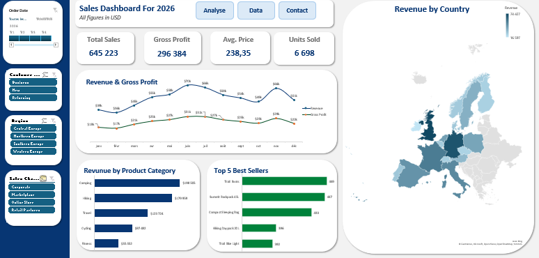

# Global Sales Performance Analytics — Excel Dashboard

<p align="center">
  
</p>

## 📊 Project Overview

This project presents an interactive Sales Performance Dashboard developed using Microsoft Excel.

The objective is to transform raw sales data into meaningful business insights through data analysis, interactive visualizations, and key performance indicators.

The dashboard provides an overview of sales performance, profitability, product categories, and geographic revenue distribution.

This project demonstrates practical skills in data analysis, business intelligence, and data visualization.

---

## 🎯 Business Objectives

The dashboard was designed to answer the following business questions:

- What is the total revenue generated?
- How does revenue evolve throughout the year?
- How does gross profit change over time?
- Which countries generate the highest revenue?
- Which product categories contribute the most to revenue?
- Which products generate the highest sales volumes?
- How can sales performance be monitored through interactive KPIs?

---

## 📈 Key Performance Indicators

| KPI | Value |
|---|---:|
| Total Revenue | $645,223 |
| Gross Profit | $296,384 |
| Average Revenue per Record | $238.35 |
| Units Sold | 6,698 |

> All financial figures are expressed in USD.

---

## 🔍 Dashboard Features

### 1. Sales Performance Analysis

- Total revenue monitoring
- Gross profit tracking
- Average revenue analysis
- Units sold overview

### 2. Revenue & Profitability Trends

- Monthly revenue evolution
- Monthly gross profit evolution
- Identification of performance fluctuations
- Comparative analysis of revenue and profitability

### 3. Geographic Analysis

- Revenue distribution by country
- Interactive geographic visualization
- Identification of high-performing markets

### 4. Product Performance Analysis

- Revenue by product category
- Top-selling products
- Sales volume comparison
- Product performance monitoring

### 5. Interactive Filters

The dashboard includes interactive filters to explore the data by:

- Customer Type
- Region
- Sales Channel
- Product Category
- Order Date

---

## 🛠️ Tools & Skills

| Category | Skills |
|---|---|
| Tool | Microsoft Excel |
| Data Analysis | Data preparation and aggregation |
| Business Intelligence | KPI development and reporting |
| Data Visualization | Charts, maps, and dashboards |
| Analysis | Sales and profitability analysis |
| Reporting | Interactive business dashboards |
| Storytelling | Business insights and data visualization |

---

## 📂 Repository Structure

```text
global-sales-performance-analytics/
│
├── README.md
├── README_FR.md
├── .gitignore
├── CONTRIBUTING.md
│
├── assets/
│   └── dashboard_preview.png
│
├── data/
│   ├── Interactive Excel Sales Dashboard.xlsx
│   └── sales_data.csv
│
└── docs/
    ├── data_dictionary.csv
    ├── key_insights.md
    └── project_notes.md
